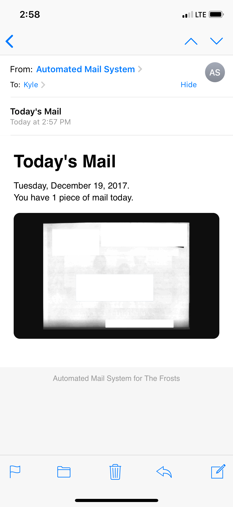

<h1 align="center">todays-mail</h1>

Have your USPS mail scans emailed to you.

## Set Up

1. Clone this repository
2. Copy `config-example.py` to `config.py`
3. Populate `config.py` with your settings
4. Run `python run.py`
5. (Optional) Set up a cron job to run every day at specific time

## Screeshot

## License
[MIT](LICENSE)
